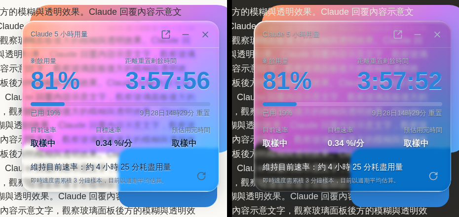

# Claude 用量儀表（claude-usage-gauge）

在 claude.ai 頁面上顯示 5 小時用量週期的即時儀表：剩餘用量、重置倒數、目前消耗速率，並依目前速率計算建議暫停時間，讓額度剛好在週期結束時用完，避免過早耗盡。

以 Chrome 擴充功能（Manifest V3）實作，介面採 Liquid Glass 風格，會依網頁明暗自動切換。



## 功能

- **用量與倒數**：剩餘用量、已用量進度條、距離重置的時分秒倒數與重置時刻
- **速率分析**：目前速率（最近 15 分鐘回歸）、目標速率（剛好在重置時用完所需的速率），以及照目前速率預估的用完時刻
- **暫停建議**：會提前耗盡時，顯示建議暫停時間、耗盡時間與用完後需空等的時間
- **顏色提示**：進度條與大數字依已用量顯示藍／橘／紅；速率依「實際速率 ÷ 目標速率」分級，只有過快時才轉黃或紅
- **操作**：拖曳面板任意處移動、拖曳四角等比縮放、雙擊面板填滿畫面（Esc 還原）、收合成膠囊、彈出成獨立視窗（可最大化、F11 全螢幕）、一鍵關閉

## 安裝

目前以「載入未封裝項目」方式安裝：

1. 下載或 clone 本倉庫
2. 開啟 `chrome://extensions`，打開右上角的「開發人員模式」
3. 按「載入未封裝項目」，選擇倉庫中的 `extension` 資料夾
4. 開啟或重新整理 [claude.ai](https://claude.ai)，面板會出現在右上角

更新時，覆蓋 `extension` 資料夾後在 `chrome://extensions` 按重新載入，再重新整理 claude.ai。

第一次使用彈出視窗時，若 Chrome 顯示已封鎖彈出式視窗，請選擇一律允許 claude.ai。

## 運作方式

擴充功能只在 `https://claude.ai/*` 注入一個 content script，不申請任何額外權限，也不連線到 claude.ai 以外的網站。

1. 以你目前的登入狀態讀取 claude.ai 網頁本身使用的用量端點，取得 5 小時週期的使用率與重置時間
2. 每 60 秒自動更新一次，並把取樣紀錄存在 claude.ai 網域的 localStorage（`cug.samples`）
3. 以最近 15 分鐘的樣本用最小平方法計算目前速率，再推算暫停時間與用完時刻

建議暫停時間的計算方式：若 `u` 為已用百分比、`r` 為距離重置的分鐘數、`v` 為目前速率（%/分），則

```
目標速率  v_target = (100 − u) / r
建議暫停  P = r − (100 − u) / v
```

`P ≤ 0` 表示照目前速率撐得到重置，不需暫停。

## 設定

設定集中在 `extension/content.js` 開頭的 `CFG` 物件，修改後重新載入擴充功能即可生效。

| 設定 | 預設值 | 說明 |
|---|---|---|
| `pollMs` | 60000 | 自動更新間隔（毫秒） |
| `rateWindowMin` | 15 | 目前速率的取樣範圍（分鐘） |
| `minSpanMin` | 3 | 樣本跨度不足時改用週期平均估算 |
| `bar.warnAt` / `bar.critAt` | 80 / 95 | 已用量達到此百分比時轉橘／紅 |
| `rate.warnK` / `rate.critK` | 1.0 / 1.5 | 速率倍數超過此值時轉黃／紅 |
| `glass.blur` | 3 | 玻璃中央的背景模糊（px） |
| `glass.refraction` | 60 | 邊緣折射強度 |
| `glass.bezel` | 26 | 折射帶寬度（px） |
| `glass.saturate` | 1.7 | 透過玻璃的色彩飽和度 |
| `scaleMin` | 0.6 | 面板縮放下限；上限為填滿可視範圍 |

## 資料夾結構

```
extension/            Chrome 擴充功能（載入這個資料夾）
├─ manifest.json
├─ content.js
└─ icons/             16／32／48／128 px 圖示與 SVG 原稿
legacy/
└─ claude-usage-gauge.user.js   篡改猴（Tampermonkey）版，最後版本 3.0.1
docs/
└─ screenshot.png
```

篡改猴版另保留於 `userscript` 分支；從 1.0.0 到 3.0.1 的每個版本都有對應標籤，可用 `git log -p` 查看完整演進。

## 限制與注意事項

- 用量資料來自 claude.ai 網頁內部使用的端點，並非公開 API，Anthropic 調整網站後可能失效，屆時面板底部會顯示紅字錯誤
- Liquid Glass 的折射效果使用 SVG backdrop-filter，目前僅 Chromium 系瀏覽器（Chrome、Edge）支援
- 彈出視窗為一般瀏覽器視窗，Chrome 基於安全會強制顯示網址列，且不會永遠置頂
- 取樣紀錄僅存在本機瀏覽器，不會上傳到任何地方

## 聲明

本專案為個人開發的非官方工具，與 Anthropic 無任何關聯，亦未經其認可。「Claude」為 Anthropic 的商標。

## 授權

[MIT License](LICENSE)
